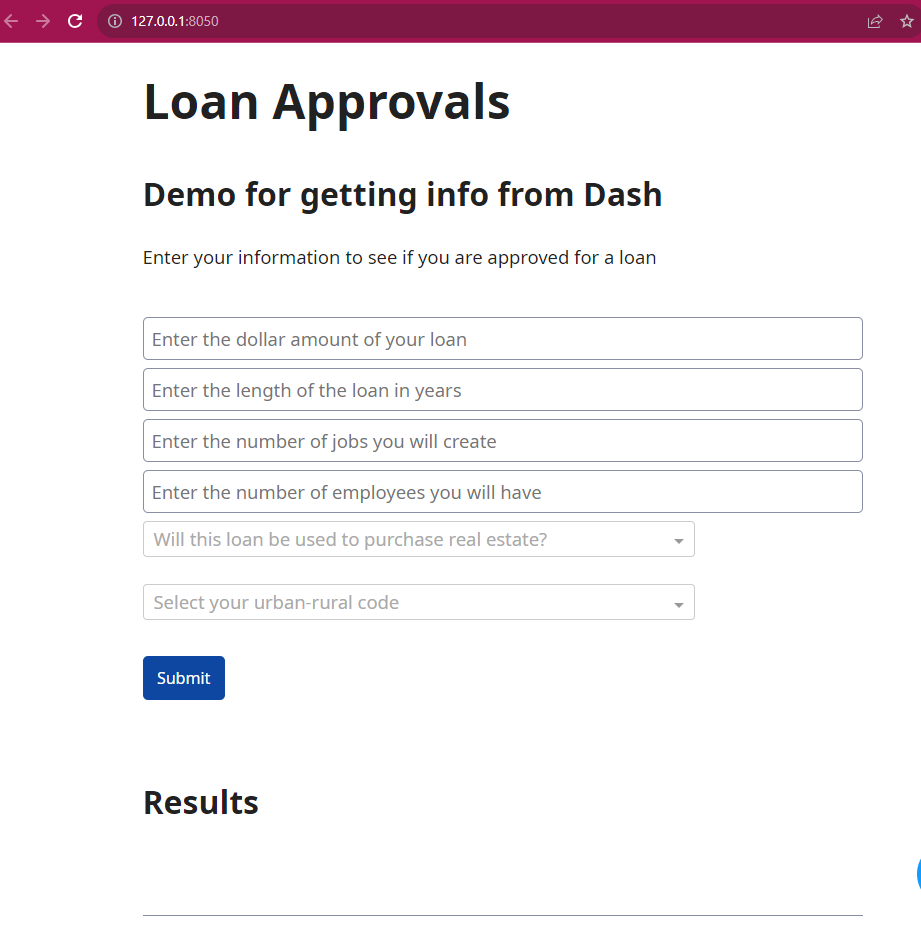

# Loan approval or denial: Web-based approval tool

This is a demonstration of using Plotly Dash to exercise a machine learning model. This will present a web page where you can enter information about a loan, and then see if you are approved.



## Instructions

1. Clone this repo. Your python environment will need:
    - Dash
    - sklearn
    - pandas
    - jupyter (if you want to run the notebook)
2. The repo already includes two pickle files, "scaler.pkl" and "model.pkl". If you change your model using the provided notebook "predict_fraud_model.ipynb", you will need to make sure you run the final cell and refresh these models.
3. To run the dash app, run the dash file from the command line:
```
python dash_example.py
```